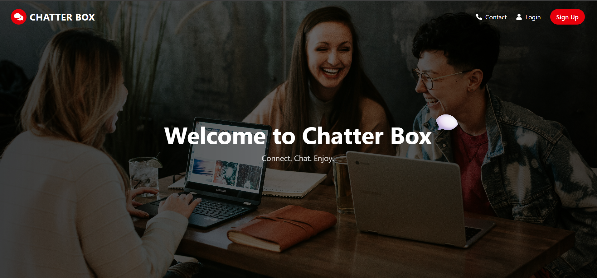
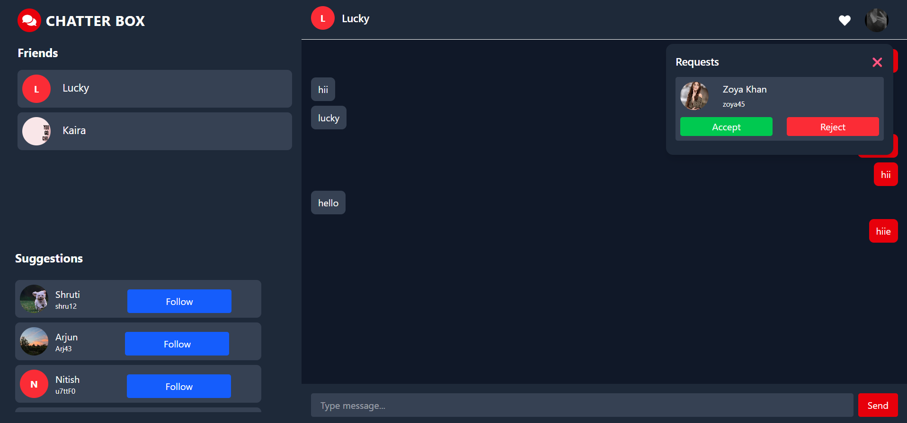
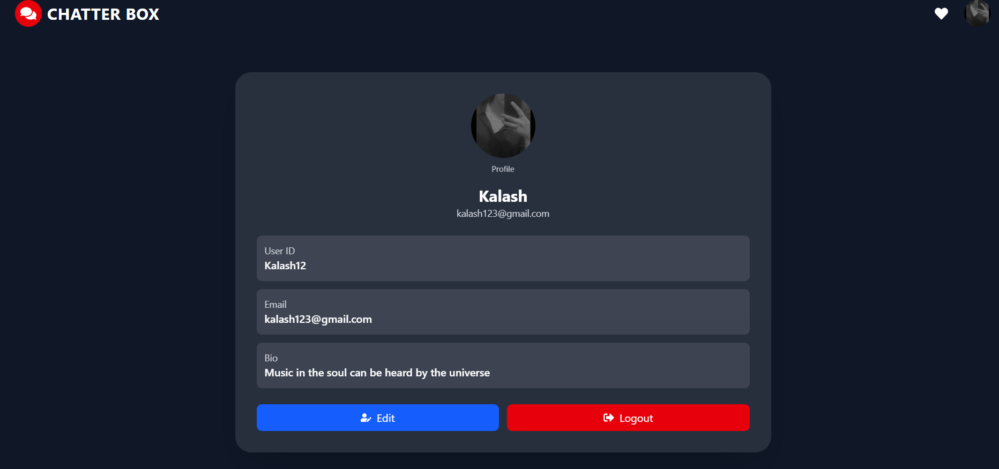
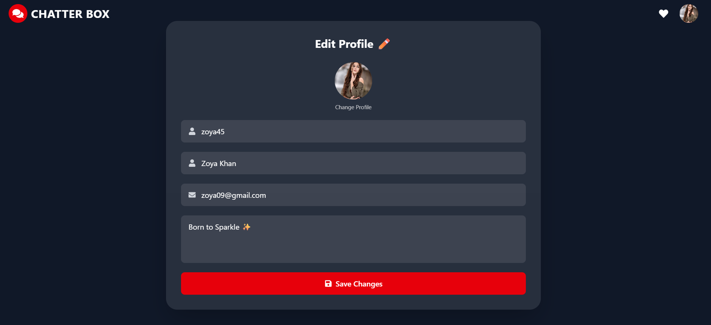

# Chatter Box

## 📖 About

Chatter Box is a real-time chat application created in Django which is designed to provide smooth and secure communication between users. This project is concerned with developing a chat app which can ensure all these functions including user authentication, instant messaging and a clean responsive interface.

This particular application allows users to create accounts, login securely and communicate with each other through interactive chat functionality. This application uses Django framework which will take care of backend development which includes authentication, efficient data handling and other operations, while the frontend will make sure that the design of the page is also user friendly and responsive.

The Chatter Box system is created to provide hands-on experience of building a project through learning full-stack development skills using all the aspects of back-end programming, database management, authentication system and frontend UI. The project shows practical usage of Django framework for authentication, users management, and dynamic communication features.


## ✨ Features

``` text
🔐 User Authentication & Authorization
💬 Real-Time Messaging System
👤 User Profile Management
📱 Responsive UI Design
⚡ Fast and Smooth Chat Experience
🎨 Clean and Modern Interface

```


## 🚀 Tech Stack


## 🎯 Purpose

The main goal of this project is to build a scalable and interactive chat platform that will improve my full-stack web development skills understanding of real-world web application architecture. 

## ✨ Screenshots

<p align="center">


</p>

<p align="center">


</p>


## 📂 Folder Structure

```text
│
├── Backend
    ├── backend
    ├── chat
    ├── media
    ├── node_modules
    ├── db.sqlite3
    ├── index.js
    ├── manage.py
    ├── package-lock.json
    └── package.json
├── Frontend
    ├── node_modules
    ├── public
    ├── src
    ├── .gitignore
    ├── eslint.config.js
    ├── index.html
    ├── package-lock.json
    ├── package.config.js
    ├── tailwind.config.js
    └── vite.config.js
├── images
└── README.md
```